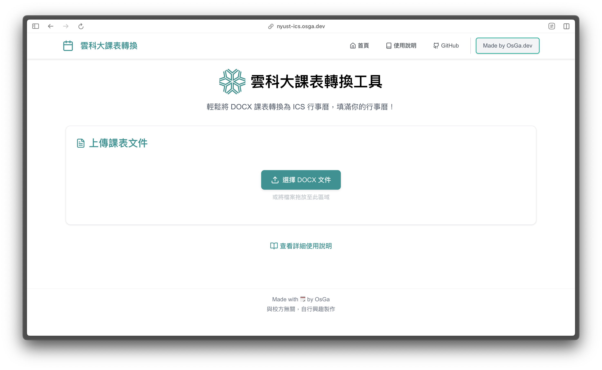
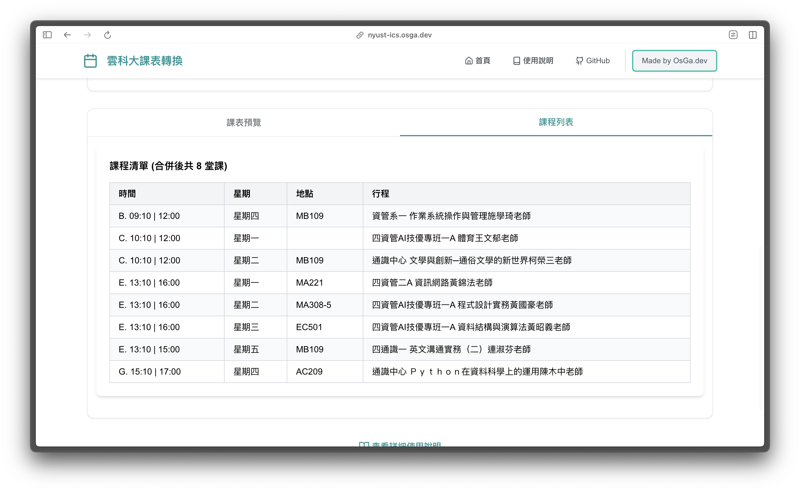
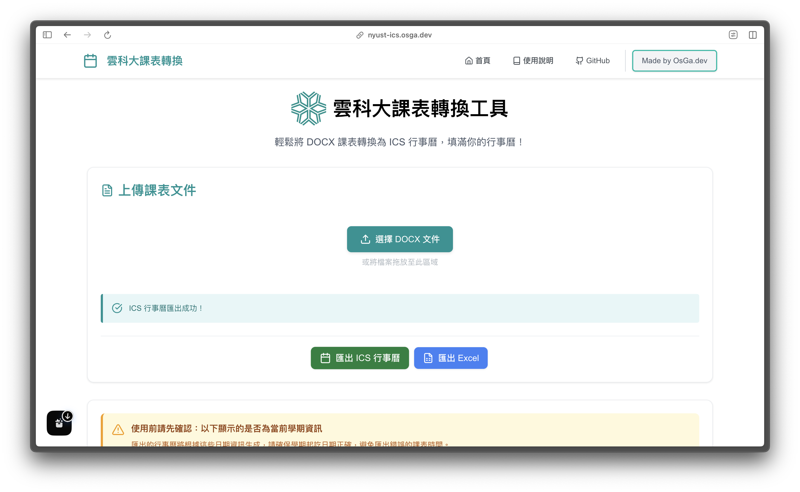
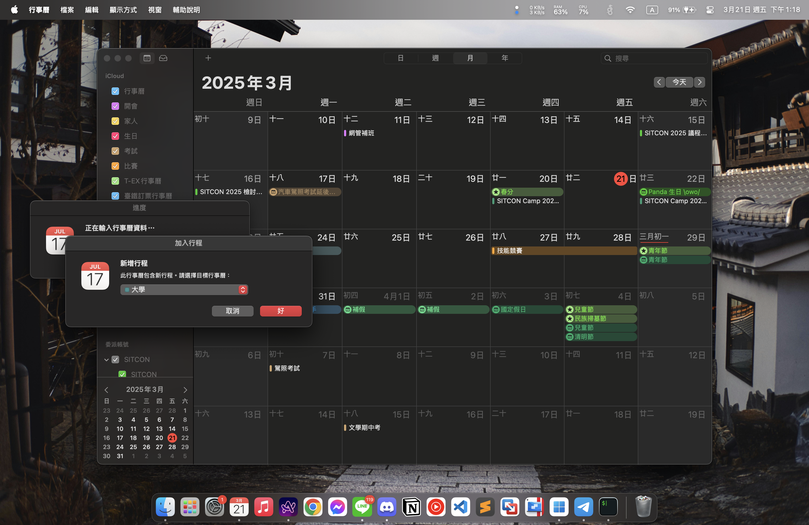
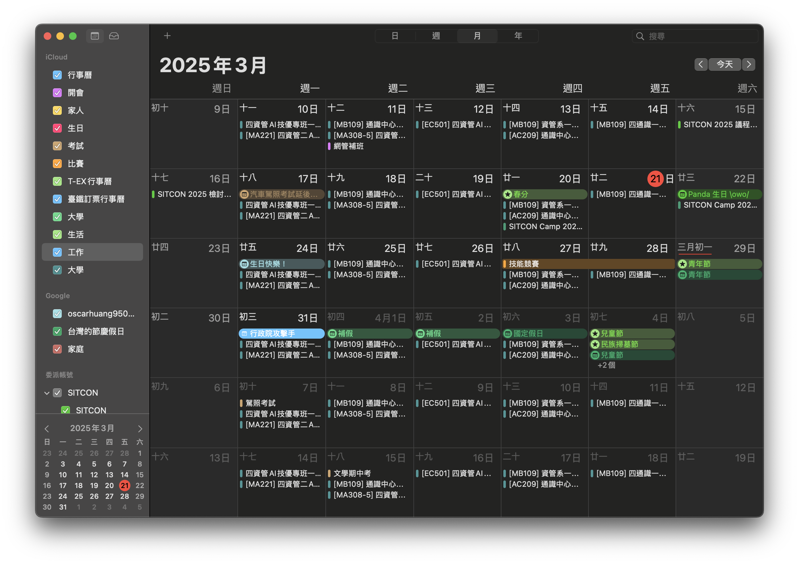

<h1 style="display: flex; align-items: center;">
  
  NYUST-ICS 雲科大課表轉換工具
</h1>

  <h4>
    🔗 <a href="https://nyust-ics.osga.dev">https://nyust-ics.osga.dev</a>
  </h4>

## 專案概述

參考隔壁棚 [台科超硬](https://github.com/WuSandWitch/NTUST-Calendar-Maker)，覺得也可以幫雲科寫一個，如果你是台科朋朋請左轉，並幫他點星星⭐

NYUST ICS 是一個專門為國立雲林科技大學學生設計的課表轉換工具。此工具可以將從單一載下的 docx 課表，轉換為標準化的 ICS 格式（iCalendar），讓學生能夠輕鬆地將課表導入到各種行事曆應用程式中，提高學習規劃與時間管理效率。

[🔗 前往網站](https://nyust-ics.osga.dev)

## 功能特色

- **多格式支持**：支援 DOCX、Excel、文本等多種課表格式
- **智能解析**：自動識別課程時間、地點和名稱
- **標準化輸出**：將解析後的課表轉換為 ICS 格式
- **連續課程合併**：自動識別並合併連續的課程時段
- **直觀預覽**：提供課表視覺化預覽功能
- **響應式設計**：適配桌面和移動裝置
- **無需註冊**：完全在瀏覽器端處理，無需帳號即可使用

## 技術棧

- **前端框架**：Next.js 14 (App Router)
- **UI 組件**：React 18+
- **樣式方案**：Tailwind CSS
- **表格解析**：Mammoth.js (DOCX), SheetJS (Excel)
- **動畫效果**：Framer Motion
- **圖標庫**：Lucide React
- **開發語言**：TypeScript

## 使用指南

1. 進入[雲科大課表轉換工具](https://nyust-ics.osga.dev/guide)

2. 上傳你的課表文件（DOCX、Excel 等）

3. 系統會自動解析並顯示課表預覽，請確認是否有誤

4. 點擊「生成 ICS 檔案」按鈕

5. 匯入進你常用的行事曆（以 Apple 為例）

6. 匯入完成，確定學期日期是否有誤，並且自行調整！

詳細使用教學可查看 [使用說明](https://nyust-ics.osga.dev/guide)
## 貢獻指南

歡迎各位對此專案提出 issue 一起優化體驗！

如有問題或建議，[歡迎與我聯繫](https://osga.dev/contect)

---

Made with 🗓️ by OsGa

